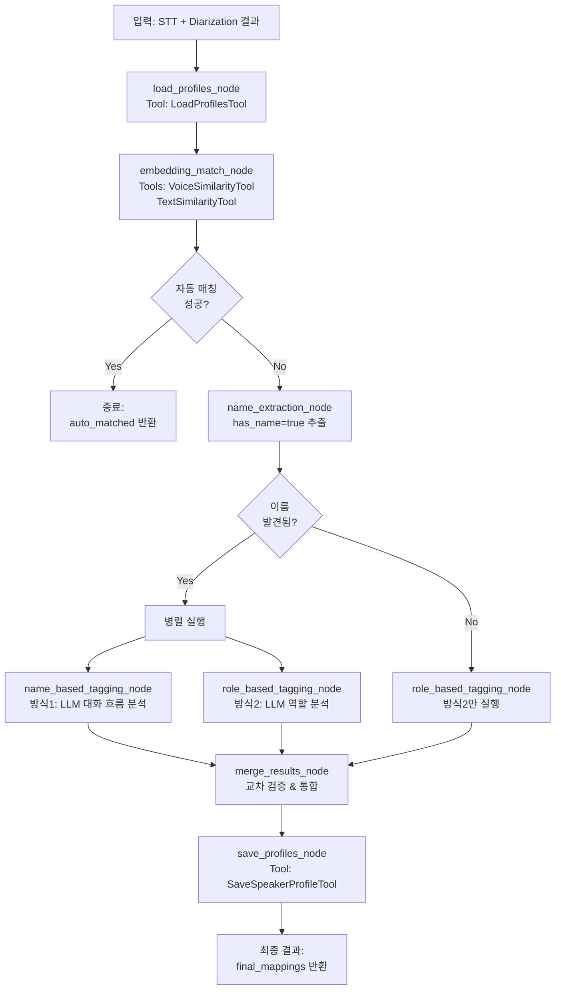

# LangGraph Agent Architecture

## 개요

화자 태깅 시스템은 **LangGraph** 기반의 에이전틱 파이프라인으로 구현됩니다.
- **입력**: STT 결과 (이름 NER 표시 포함) + Diarization 결과 (임베딩 포함)
- **출력**: 화자별 이름/역할 매핑 결과
- **핵심**: 방식1 (이름 기반) + 방식2 (역할 기반) 병렬 실행 후 교차 검증

---

## State 정의

```python
from typing import TypedDict, List, Dict, Optional

class AgentState(TypedDict):
    # 입력 데이터
    user_id: int
    audio_file_id: int
    stt_result: List[Dict]           # [{text, start, end, speaker, has_name}, ...]
    diar_result: Dict                # {embeddings: {...}, turns: [...]}

    # Agent가 생성하는 중간 데이터
    previous_profiles: List[Dict]    # DB에서 로드한 기존 화자 프로필
    auto_matched: Dict[str, str]     # 임베딩 자동 매칭 성공한 화자 {"SPEAKER_00": "김민서"}
    name_mentions: List[Dict]        # has_name=true인 것들 추출
    conversation_flows: List[Dict]   # 각 이름 언급 주변 대화 흐름
    speaker_utterances: Dict         # 화자별로 묶은 발화들

    # LLM 판단 결과
    name_based_results: Dict         # 방식1 결과
    role_based_results: Dict         # 방식2 결과

    # 최종 출력
    final_mappings: Dict             # 통합된 최종 매핑
    needs_manual_review: List[str]   # 수동 확인 필요한 화자 목록
```

---

## Tools 정의

### 1. LoadProfilesTool
**목적**: user_speaker_profiles DB에서 기존 프로필 로드

```python
@tool
def load_speaker_profiles(user_id: int) -> List[Dict]:
    """
    사용자가 이전에 저장한 화자 프로필들을 DB에서 가져옵니다.

    Args:
        user_id: 사용자 ID

    Returns:
        List[{name, voice_embedding, text_embedding, sample_texts, last_heard_at}]
    """
    # DB 조회 로직
    pass
```

### 2. VoiceSimilarityTool
**목적**: 음성 임베딩 코사인 유사도 계산

```python
@tool
def calculate_voice_similarity(
    new_embedding: List[float],
    stored_profiles: List[Dict]
) -> Dict:
    """
    새 화자의 음성 임베딩과 DB의 프로필들을 비교합니다.

    Args:
        new_embedding: 현재 오디오의 화자 임베딩
        stored_profiles: DB에 저장된 프로필들

    Returns:
        {
            "matched_profile": "김민서" or None,
            "similarity": 0.92,
            "threshold_passed": True/False
        }
    """
    # 코사인 유사도 계산
    pass
```

### 3. TextSimilarityTool
**목적**: 발화 스타일 임베딩 유사도 계산

```python
@tool
def calculate_text_similarity(
    current_utterances: List[str],
    stored_profiles: List[Dict]
) -> Dict:
    """
    화자의 발화 스타일을 DB의 프로필들과 비교합니다.

    Args:
        current_utterances: 현재 화자의 발화들
        stored_profiles: DB에 저장된 프로필들

    Returns:
        {
            "matched_profile": "김민서" or None,
            "similarity": 0.87,
            "sample_comparison": {...}
        }
    """
    # 텍스트 임베딩 유사도 계산
    pass
```

### 4. SaveSpeakerProfileTool
**목적**: 새 화자 프로필을 DB에 저장/업데이트

```python
@tool
def save_speaker_profile(
    user_id: int,
    speaker_name: str,
    voice_embedding: List[float],
    text_embedding: List[float],
    sample_texts: List[str]
) -> bool:
    """
    화자 프로필을 user_speaker_profiles 테이블에 저장합니다.

    Args:
        user_id: 사용자 ID
        speaker_name: 화자 이름
        voice_embedding: 음성 임베딩
        text_embedding: 텍스트 임베딩
        sample_texts: 샘플 발화들

    Returns:
        저장 성공 여부
    """
    # DB INSERT or UPDATE
    pass
```

---

## Graph 구조



---

## 노드별 상세 로직

### 1. load_profiles_node

```python
async def load_profiles_node(state: AgentState) -> AgentState:
    """
    user_speaker_profiles DB에서 기존 프로필들을 로드합니다.
    """
    profiles = await LoadProfilesTool.ainvoke({"user_id": state["user_id"]})
    state["previous_profiles"] = profiles
    return state
```

### 2. embedding_match_node

```python
async def embedding_match_node(state: AgentState) -> AgentState:
    """
    음성 + 텍스트 임베딩으로 자동 매칭을 시도합니다.
    임계값(0.85) 이상이면 자동 매칭 성공.
    """
    auto_matched = {}

    for speaker_label, voice_emb in state["diar_result"]["embeddings"].items():
        # 이 화자의 발화들 추출
        utterances = extract_speaker_texts(speaker_label, state["stt_result"], state["diar_result"])

        # Tool 2: 음성 유사도
        voice_result = await VoiceSimilarityTool.ainvoke({
            "new_embedding": voice_emb,
            "stored_profiles": state["previous_profiles"]
        })

        # Tool 3: 텍스트 유사도
        text_result = await TextSimilarityTool.ainvoke({
            "current_utterances": utterances,
            "stored_profiles": state["previous_profiles"]
        })

        # 둘 다 임계값 통과 & 같은 사람 지목
        if (voice_result["threshold_passed"] and
            text_result["similarity"] > 0.85 and
            voice_result["matched_profile"] == text_result["matched_profile"]):

            auto_matched[speaker_label] = voice_result["matched_profile"]

    state["auto_matched"] = auto_matched
    return state
```

### 3. name_extraction_node

```python
async def name_extraction_node(state: AgentState) -> AgentState:
    """
    STT 결과에서 has_name=true인 것들을 추출하고,
    각 이름 주변의 대화 흐름을 추출합니다.
    """
    name_mentions = []

    for idx, word in enumerate(state["stt_result"]):
        if word.get("has_name"):
            # 이름 언급 전후 5문장 추출
            context = extract_context_around_name(
                idx,
                state["stt_result"],
                state["diar_result"],
                window=5
            )

            name_mentions.append({
                "name": word["text"],
                "mentioned_by": word["speaker"],
                "time": word["start"],
                "context": context
            })

    state["name_mentions"] = name_mentions

    # 화자별 발화도 미리 준비
    state["speaker_utterances"] = group_by_speaker(
        state["stt_result"],
        state["diar_result"]
    )

    return state
```

### 4. name_based_tagging_node (방식1)

```python
async def name_based_tagging_node(state: AgentState) -> AgentState:
    """
    방식1: 이름 기반 태깅
    - LLM에게 대화 흐름을 보여주고 "민서는 SPEAKER_00? SPEAKER_01?" 판단
    """
    name_results = {}

    for mention in state["name_mentions"]:
        # LLM 프롬프트 구성
        prompt = f"""
        다음은 회의 대화 기록입니다. 화자를 특정해야 합니다.

        이름 "{mention['name']}"이 언급된 문맥:
        {format_conversation_context(mention['context'])}

        질문: "{mention['name']}"는 위 대화에서 어느 화자(SPEAKER_XX)인가요?
        근거와 함께 답변해주세요.
        """

        # LLM 호출
        response = await llm.ainvoke([
            {"role": "system", "content": "당신은 대화 분석 전문가입니다."},
            {"role": "user", "content": prompt}
        ])

        # 파싱: {"matched_speaker": "SPEAKER_00", "confidence": 0.95, "reasoning": "..."}
        result = parse_llm_response(response)

        name_results[mention['name']] = result

    state["name_based_results"] = name_results
    return state
```

### 5. role_based_tagging_node (방식2)

```python
async def role_based_tagging_node(state: AgentState) -> AgentState:
    """
    방식2: 역할 기반 태깅
    - LLM에게 각 화자의 발화 패턴을 보여주고 역할 추론
    """
    role_results = {}

    for speaker_label, utterances in state["speaker_utterances"].items():
        # 통계 계산
        stats = calculate_speaker_stats(speaker_label, state["diar_result"])

        # LLM 프롬프트 구성
        prompt = f"""
        다음은 {speaker_label}의 발화 목록입니다.

        발화 샘플 (처음 10개):
        {format_utterances(utterances[:10])}

        통계:
        - 총 발화 시간: {stats['duration']}초
        - 발화 횟수: {stats['turn_count']}회

        질문: 이 화자의 역할을 추론해주세요 (진행자, 발표자, 참여자 등).
        근거와 함께 답변해주세요.
        """

        # LLM 호출
        response = await llm.ainvoke([
            {"role": "system", "content": "당신은 회의 분석 전문가입니다."},
            {"role": "user", "content": prompt}
        ])

        # 파싱: {"role": "진행자", "confidence": 0.92, "reasoning": "..."}
        result = parse_llm_response(response)

        role_results[speaker_label] = result

    state["role_based_results"] = role_results
    return state
```

### 6. merge_results_node

```python
async def merge_results_node(state: AgentState) -> AgentState:
    """
    방식1, 방식2 결과를 통합하고 교차 검증합니다.
    """
    final_mappings = {}
    needs_review = []

    # 자동 매칭된 화자는 그대로 사용
    for speaker_label, name in state.get("auto_matched", {}).items():
        final_mappings[speaker_label] = {
            "speaker_label": speaker_label,
            "name": name,
            "role": state["role_based_results"].get(speaker_label, {}).get("role"),
            "match_method": "embedding",
            "auto_matched": True,
            "needs_review": False
        }

    # 방식1, 방식2 결과 통합
    all_speakers = set(state["speaker_utterances"].keys())

    for speaker_label in all_speakers:
        if speaker_label in state.get("auto_matched", {}):
            continue  # 이미 처리됨

        mapping = {"speaker_label": speaker_label}

        # 방식1 결과 (이름)
        name_result = find_matching_name(speaker_label, state["name_based_results"])
        if name_result:
            mapping["name"] = name_result["name"]
            mapping["name_confidence"] = name_result["confidence"]
            mapping["name_reasoning"] = name_result["reasoning"]

        # 방식2 결과 (역할)
        role_result = state["role_based_results"].get(speaker_label)
        if role_result:
            mapping["role"] = role_result["role"]
            mapping["role_confidence"] = role_result["confidence"]
            mapping["role_reasoning"] = role_result["reasoning"]

        # 교차 검증
        if name_result and role_result:
            mapping["cross_validated"] = True
            mapping["combined_confidence"] = (
                name_result["confidence"] * 0.6 +
                role_result["confidence"] * 0.4
            )

        # 신뢰도 낮거나 모순 발견 시 수동 확인 필요
        if (mapping.get("name_confidence", 1.0) < 0.7 or
            mapping.get("role_confidence", 1.0) < 0.7):
            mapping["needs_review"] = True
            needs_review.append(speaker_label)
        else:
            mapping["needs_review"] = False

        final_mappings[speaker_label] = mapping

    state["final_mappings"] = final_mappings
    state["needs_manual_review"] = needs_review
    return state
```

### 7. save_profiles_node

```python
async def save_profiles_node(state: AgentState) -> AgentState:
    """
    확정된 화자 프로필을 DB에 저장합니다.
    """
    for speaker_label, mapping in state["final_mappings"].items():
        if mapping.get("name") and not mapping.get("auto_matched"):
            # 새로운 화자 프로필 저장
            voice_emb = state["diar_result"]["embeddings"][speaker_label]
            utterances = state["speaker_utterances"][speaker_label]
            text_emb = calculate_text_embedding(utterances)

            await SaveSpeakerProfileTool.ainvoke({
                "user_id": state["user_id"],
                "speaker_name": mapping["name"],
                "voice_embedding": voice_emb,
                "text_embedding": text_emb,
                "sample_texts": utterances[:10]  # 처음 10개 발화 저장
            })

    return state
```

---

## 조건부 분기 로직

```python
from langgraph.graph import StateGraph, END

# 그래프 생성
graph = StateGraph(AgentState)

# 노드 추가
graph.add_node("load_profiles", load_profiles_node)
graph.add_node("embedding_match", embedding_match_node)
graph.add_node("name_extraction", name_extraction_node)
graph.add_node("name_based_tagging", name_based_tagging_node)
graph.add_node("role_based_tagging", role_based_tagging_node)
graph.add_node("merge_results", merge_results_node)
graph.add_node("save_profiles", save_profiles_node)

# 엣지 (순차)
graph.add_edge("load_profiles", "embedding_match")

# 조건부 분기 1: 자동 매칭 성공?
graph.add_conditional_edges(
    "embedding_match",
    lambda state: "end" if all_speakers_auto_matched(state) else "name_extraction"
)

# 조건부 분기 2: 이름 발견됨?
graph.add_conditional_edges(
    "name_extraction",
    lambda state: "parallel" if state.get("name_mentions") else "role_only",
    {
        "parallel": ["name_based_tagging", "role_based_tagging"],  # 병렬 실행
        "role_only": "role_based_tagging"
    }
)

# 병렬 실행 후 통합
graph.add_edge(["name_based_tagging", "role_based_tagging"], "merge_results")
graph.add_edge("role_based_tagging", "merge_results")  # role_only 경로

# 최종 저장
graph.add_edge("merge_results", "save_profiles")
graph.add_edge("save_profiles", END)

# 진입점 설정
graph.set_entry_point("load_profiles")

# 컴파일
app = graph.compile()
```

---

## 실행 예시

```python
# 입력 데이터
initial_state = {
    "user_id": 1,
    "audio_file_id": 123,
    "stt_result": [
        {"text": "네", "start": 3.6, "end": 3.8, "speaker": "SPEAKER_00"},
        {"text": "민서씨", "start": 3.9, "end": 4.5, "speaker": "SPEAKER_01", "has_name": True},
        {"text": "오늘", "start": 4.6, "end": 4.9, "speaker": "SPEAKER_01"},
        # ...
    ],
    "diar_result": {
        "embeddings": {
            "SPEAKER_00": [0.12, -0.45, ...],
            "SPEAKER_01": [0.33, 0.76, ...]
        },
        "turns": [...]
    }
}

# Agent 실행
final_state = await app.ainvoke(initial_state)

# 결과
print(final_state["final_mappings"])
# {
#   "SPEAKER_00": {
#     "name": "김민서",
#     "role": "진행자",
#     "name_confidence": 0.95,
#     "role_confidence": 0.92,
#     "cross_validated": True,
#     "needs_review": False
#   },
#   "SPEAKER_01": {
#     "name": "박철수",
#     "role": "발표자",
#     ...
#   }
# }
```

---

## FastAPI 통합

```python
from fastapi import BackgroundTasks

@app.post("/api/v1/tagging/analyze")
async def analyze_speakers(
    audio_file_id: int,
    background_tasks: BackgroundTasks,
    current_user: User = Depends(get_current_user)
):
    """
    화자 태깅 Agent를 백그라운드로 실행합니다.
    """
    # STT, Diarization 결과 조회 (DB에서)
    stt_result = get_stt_result(audio_file_id)
    diar_result = get_diarization_result(audio_file_id)

    # Agent 실행 (백그라운드)
    background_tasks.add_task(
        run_tagging_agent,
        user_id=current_user.id,
        audio_file_id=audio_file_id,
        stt_result=stt_result,
        diar_result=diar_result
    )

    return {"status": "processing", "audio_file_id": audio_file_id}

async def run_tagging_agent(user_id, audio_file_id, stt_result, diar_result):
    """
    Agent 실행 및 결과 DB 저장
    """
    initial_state = {
        "user_id": user_id,
        "audio_file_id": audio_file_id,
        "stt_result": stt_result,
        "diar_result": diar_result
    }

    # Agent 실행
    final_state = await app.ainvoke(initial_state)

    # 결과 DB 저장
    save_speaker_mappings(audio_file_id, final_state["final_mappings"])
```

---

## LangSmith 추적

```python
import os
from langsmith import traceable

# 환경 변수 설정
os.environ["LANGCHAIN_TRACING_V2"] = "true"
os.environ["LANGCHAIN_API_KEY"] = "your-api-key"
os.environ["LANGCHAIN_PROJECT"] = "speaker-tagging-agent"

# 자동으로 모든 노드 추적됨
# LangSmith 대시보드에서:
# - 각 노드의 입출력
# - LLM 호출 내역
# - Tool 사용 내역
# - 실행 시간
# 모두 확인 가능
```

---

## 요약

- ✅ **입력**: STT (이름 표시) + Diarization (임베딩)
- ✅ **Tools 4개**: LoadProfiles, VoiceSimilarity, TextSimilarity, SaveProfile
- ✅ **노드 7개**: load → embedding_match → name_extraction → (name_based || role_based) → merge → save
- ✅ **병렬 실행**: 이름 있으면 방식1+방식2 동시 실행
- ✅ **교차 검증**: 두 방식 결과 비교하여 신뢰도 상승
- ✅ **자동 매칭**: 임베딩 유사도 높으면 DB 프로필로 즉시 매칭
- ✅ **LangSmith**: 전체 과정 추적 및 디버깅
